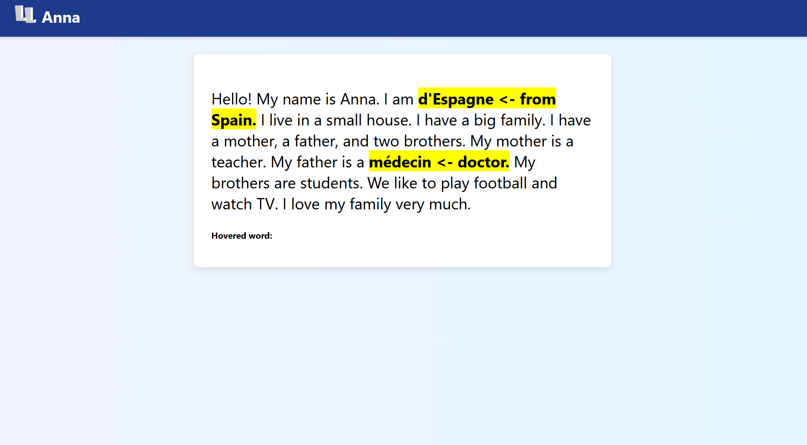

**Overview:**
This is an extension that allows for dynamic translation of a website by clicking words. 
To run this project, gather all these files into a folder, and Unpack them on "chrome://extensions" developer mode on chrome.

**How it works:**
When first run, the javascript program will go through the entire website, and wrap every single word into a  while retaining the style of the site.
The function setupWordEv(s) applies a click listener, which will make each span clickable.
When clicked, the google api will translate the word and replace it on the site.
If a cluster of words is found, it will translate them all to retain context.
When a translated word is clicked, it will return back to normal.

**Future updates:**

Adding a button on the api to allow for language changing
Running the website 24/7 to allow for translation anytime
Adding translated words to the SQL database to create flashcards on user weak points.

(Last updated July 2025)

